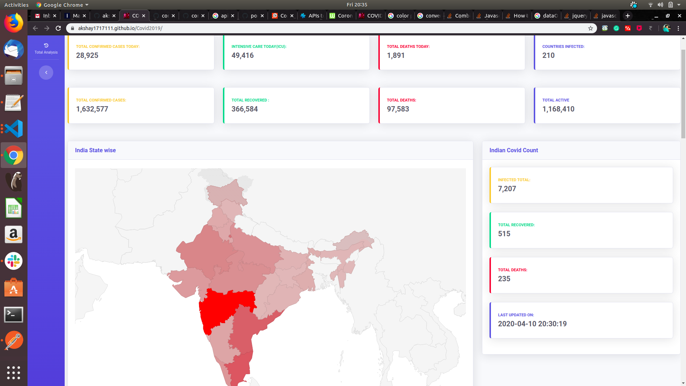
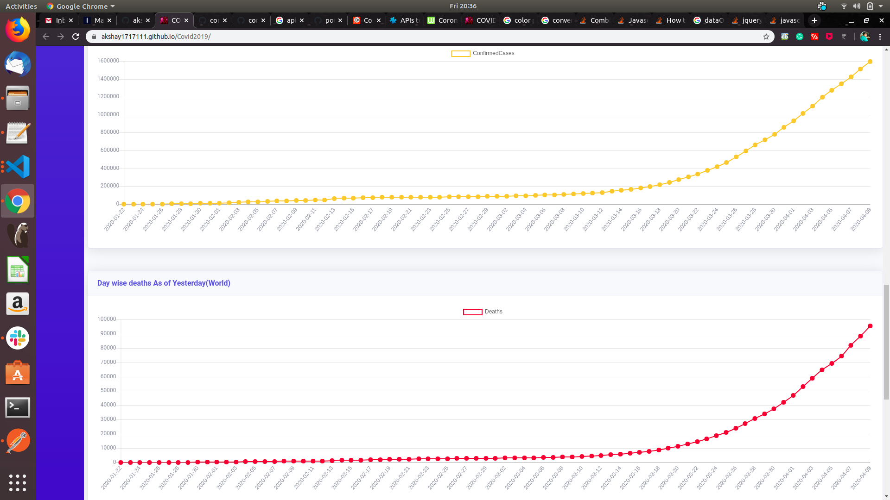

## Welcome to GitHub Pages

You can use the [editor on GitHub](https://github.com/akshay1717111/Covid2019/edit/master/README.md) to maintain and preview the content for your website in Markdown files.

Templates For Dashboard

To view Visualization : https://akshay1717111.github.io/Covid2019/

Source: CORONAVIRUS DATA API (THEVIRUSTRACKER.COM)
